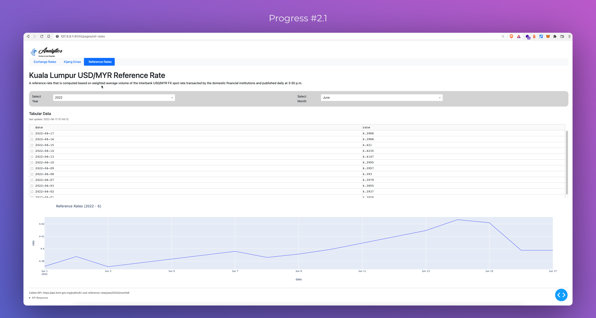
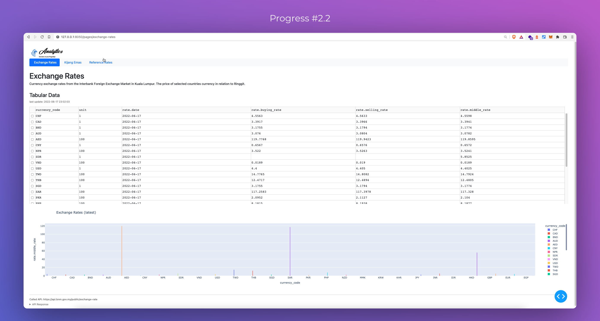

## How I discovered Dash:
Searching for something to try out with Python
- https://www.monocubed.com/blog/top-python-frameworks/

Spotted `Dash` have `LDAP Integration`, which could be useful and practical for Enterprise Intranet Environment.
So decided to give it a try.

----

## Started with the basics:
- https://dash.plotly.com/installation
- https://dash.plotly.com/layout

## Sneak peek of current progress

## Target:
- https://towardsdatascience.com/create-a-professional-dasbhoard-with-dash-and-css-bootstrap-e1829e238fc5

## TODOS:
- [x] Calls API
- [x] Data Tables
- [x] Graph
- [x] Reference Rates
- [x] multi-page dashboard
- [x] use bootstrap
- [ ] Refactor code to be more reusable (on-going)
- [ ] Exchange Rates (work in progress)
- [ ] Kijang Emas
- [ ] authenticated API calls (other APIs)
- [ ] LDAP SSO (seems to be available on enterprise copies only)